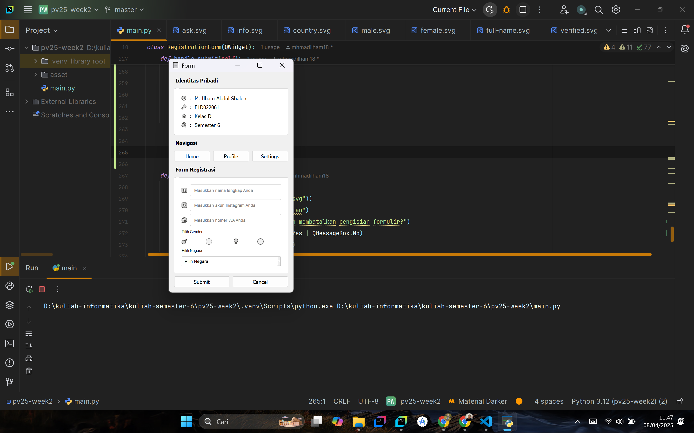
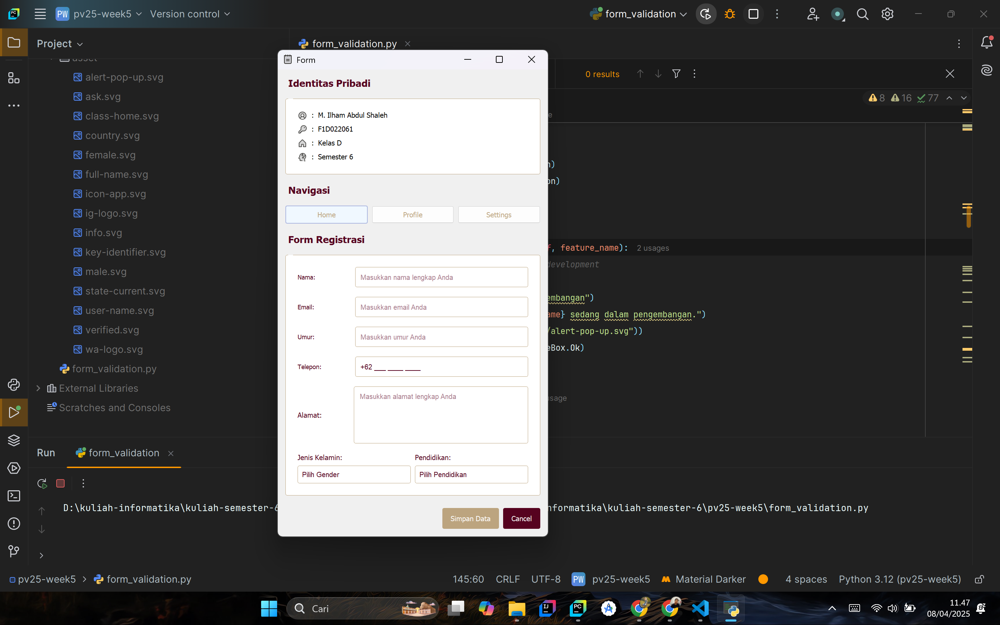

# Aplikasi Form Validasi Berbasis PyQt5

## 👤 Data Mahasiswa

| Nama                  | NIM         |
|-----------------------|-------------|
| M. ILHAM ABDUL SHALEH | F1D022061   |

---

## 🛠️ Teknologi yang Digunakan

- Python 3.10+
- PyQt5

---

## 📋 Fitur Utama

| Fitur                                                                 | Status     |
|-----------------------------------------------------------------------|------------|
| Nama (tidak boleh kosong, minimal 3 karakter)                         | ✅ Selesai |
| Email (valid format: contoh@domain.com)                               | ✅ Selesai |
| Umur (harus berupa angka)                                             | ✅ Selesai |
| Nomor Telepon (input mask: `+62 999 9999 9999`)                       | ✅ Selesai |
| Alamat (tidak boleh kosong)                                           | ✅ Selesai |
| Jenis Kelamin (dropdown)                                              | ✅ Selesai |
| Pendidikan (dropdown)                                                 | ✅ Selesai |
| Validasi dilakukan sebelum data disimpan                              | ✅ Selesai |
| Tombol **Simpan** hanya aktif jika semua input valid                  | ✅ Selesai |
| Pesan peringatan jika ada input yang tidak valid                      | ✅ Selesai |
| Field dikosongkan otomatis setelah penyimpanan berhasil               | ✅ Selesai |
| Shortcut `Q` untuk keluar dari aplikasi                               | ✅ Selesai |

---

## 🖼️ Screenshot Tampilan Aplikasi

### 1. Desain UI dari Tugas pv25-week2

---

### 2. Desain UI dari Tugas pv25-week5

---

## 🧱 Catatan Pengembangan

Tugas ini merupakan pengembangan dari tugas **pv25-week2**, dengan menambahkan:
- Komponen validasi form secara lengkap.
- Interaksi logika penyimpanan data.
- Input masking & validator untuk nomor telepon.
- Shortcut keyboard.
- Perbaikan tampilan dan layout form agar lebih konsisten.

---

